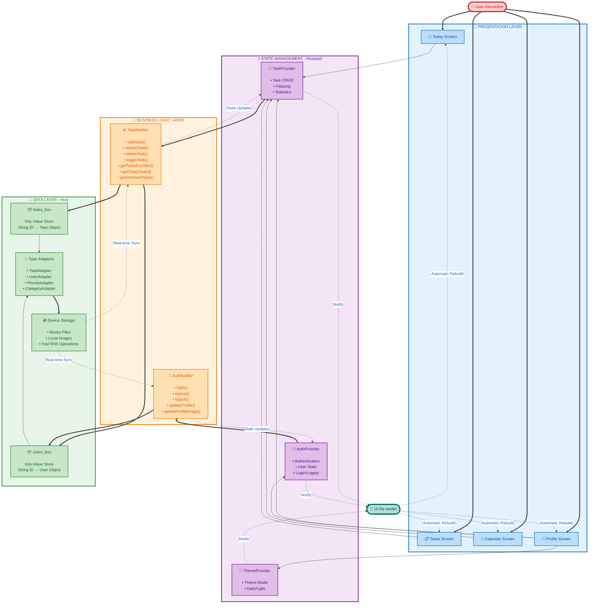
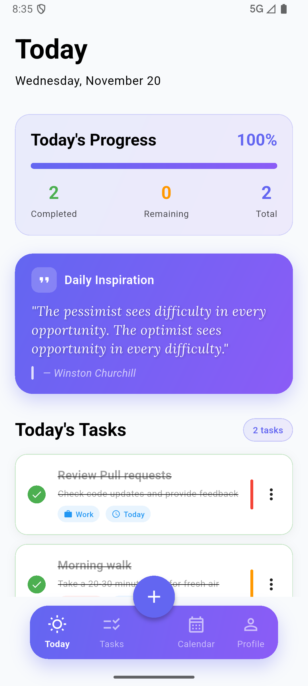
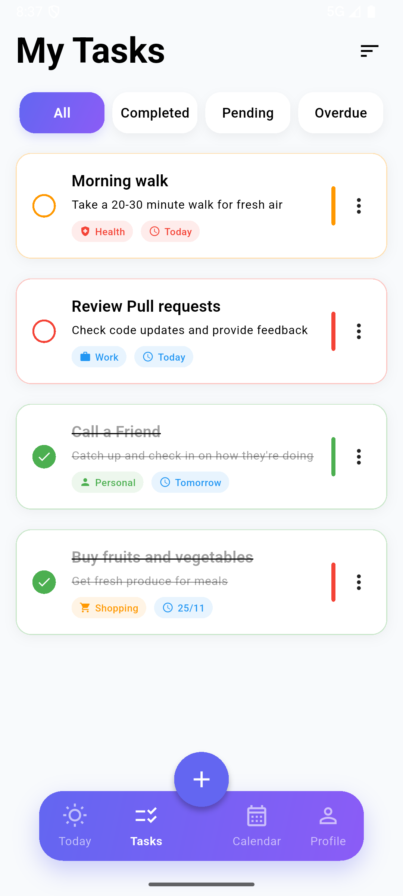
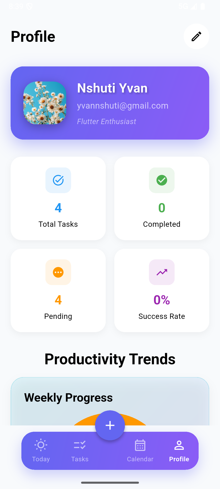
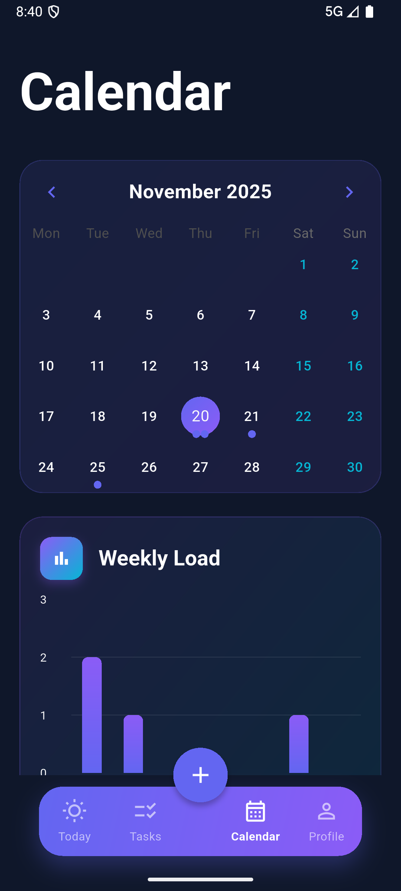

# ✅ Flutter Todo App - Modern Task Management

<div align="center">


*A beautiful, modern, and feature-rich todo application built with Flutter, featuring elegant UI/UX, local storage with Hive, and powerful task management capabilities.*

[Features](#-features) • [Screenshots](#-screenshots) • [Installation](#-installation) • [Demo](#-demo-video) • [Download APK](#-download-apk)

</div>

---

## 🌟 Overview

Flutter Todo App is a cutting-edge task management solution that combines beautiful design with powerful functionality. Built entirely with Flutter and Dart, it provides a seamless, cross-platform experience for managing your daily tasks, projects, and goals. With its intuitive interface, comprehensive features, and offline-first architecture, staying organized has never been easier.

### 🎯 Mission
To deliver a premium task management experience that's beautiful, fast, and helps users achieve their goals through smart organization and insightful productivity tracking.

---

# 🎥 Demo Video

<div align="center">

<a href="https://youtu.be/mbNrKldG-Hc?si=VcrTshc3dG8zANIv">

</a>

<br>

### 🎬 **Watch the Full Demo on YouTube**

[](https://youtu.be/mbNrKldG-Hc?si=VcrTshc3dG8zANIv)
[](https://youtu.be/mbNrKldG-Hc?si=VcrTshc3dG8zANIv)

**Experience the complete feature tour with smooth animations**

</div>

**Demo Highlights:**
- 🚀 Smooth onboarding experience with elegant animations
- ✅ Intuitive task creation and management workflow
- 📅 Interactive calendar view with visual task indicators
- 📊 Comprehensive productivity analytics and charts
- 🎨 Seamless dark/light theme switching
- 👤 User profile customization and settings

---

## ✨ Features

### 📝 Advanced Task Management
- **Smart Task Creation**: Quick task entry with title, description, due date, priority, and category
- **Priority Levels**: Organize tasks with four priority levels (Low, Medium, High, Urgent)
- **Category System**: Categorize tasks (Work, Personal, Health, Education, Shopping, Other)
- **Due Date Tracking**: Set deadlines and never miss important tasks
- **Completion Tracking**: Mark tasks as complete with timestamp recording
- **Task Editing**: Update task details anytime with inline editing
- **Swipe Actions**: Quick complete, edit, or delete with smooth swipe gestures

### 📅 Calendar Integration
- **Visual Task Calendar**: Beautiful calendar view powered by Table Calendar
- **Date-based Filtering**: View tasks for any specific date
- **Task Indicators**: Visual dots showing tasks scheduled for each day
- **Month Navigation**: Easily browse through months to plan ahead
- **Today Highlight**: Clear indication of the current day
- **Selected Date Focus**: Detailed task list for selected dates

### 📊 Productivity Analytics
- **Task Statistics**: Track total, completed, pending, and overdue tasks
- **Completion Rate**: Visual progress indicators showing productivity
- **Category Breakdown**: Charts showing task distribution by category
- **Priority Analysis**: Understand your task priorities at a glance
- **Productivity Charts**: Beautiful FL Chart visualizations of your workflow
- **Streak Tracking**: Monitor daily task completion patterns

### 🎯 Today Screen
- **Daily Overview**: Focus on today's tasks for better productivity
- **Progress Indicator**: Visual representation of daily task completion
- **Motivational Quotes**: Daily inspiration to keep you motivated
- **Task Counter**: Real-time count of today's tasks
- **Quick Actions**: Fast access to task management features

### 👤 User Profile & Settings
- **User Authentication**: Secure login and signup system
- **Profile Customization**: Edit name, bio, phone, and profile picture
- **Image Upload**: Camera and gallery support for profile photos
- **Theme Toggle**: Seamless switching between dark and light modes
- **Statistics Dashboard**: Personal productivity metrics at a glance
- **Account Management**: Secure logout and data protection

### 🎨 Premium User Experience
- **Material Design 3**: Modern UI components with beautiful animations
- **Dark/Light Theme**: Adaptive theming that respects user preferences
- **Gradient Accents**: Premium gradient effects throughout the app
- **Smooth Animations**: Polished transitions and micro-interactions
- **Custom Fonts**: Beautiful Inter and Lora font families
- **Responsive Design**: Optimized for all screen sizes
- **Glassmorphism**: Modern translucent UI elements

### 💾 Offline-First Architecture
- **Local Storage**: All data stored locally with Hive database
- **No Internet Required**: Full functionality without connectivity
- **Fast Performance**: Lightning-fast data access and updates
- **Data Persistence**: Your tasks are always saved and secure
- **Automatic Syncing**: Seamless data updates across sessions

---

## 🏗️ Technology Stack

### Frontend Framework
- **Flutter 3.0+** - Google's UI toolkit for cross-platform development
- **Dart 3.0+** - Modern, optimized programming language
- **Material Design 3** - Latest Material You design system

### State Management & Architecture
- **Flutter Riverpod 2.4.9** - Powerful, compile-safe state management
- **Provider Pattern** - Clean separation of business logic and UI
- **MVVM Architecture** - Model-View-ViewModel pattern for scalability
- **State Notifiers** - Reactive state updates across the app

### Local Storage & Data Persistence
- **Hive 2.2.3** - Lightweight, fast NoSQL database
- **Hive Flutter 1.1.0** - Flutter integration for Hive
- **Type Adapters** - Custom serialization for complex models
- **Offline-First** - All data stored locally for instant access

### UI/UX Libraries
- **Table Calendar 3.0.9** - Feature-rich calendar widget
- **FL Chart 0.65.0** - Beautiful, animated charts and graphs
- **Image Picker 1.0.7** - Camera and gallery integration
- **Permission Handler 11.0.1** - Runtime permission management
- **Custom Fonts** - Inter and Lora font families for premium typography

### Development Tools
- **Build Runner 2.4.7** - Code generation for type adapters
- **Hive Generator 2.0.1** - Automatic Hive adapter generation
- **Flutter Lints 3.0.0** - Official Flutter linting rules
- **Cupertino Icons** - iOS-style icons for cross-platform consistency

---

## 🎨 UI/UX Design Philosophy

### Design Language
Our design system is built on the principles of **Clarity**, **Simplicity**, and **Elegance**, featuring:

- **Modern Color Palette**: Carefully crafted colors that inspire productivity
  - Primary: Indigo 500 (#6366F1) - Trust and focus
  - Secondary: Purple 500 (#8B5CF6) - Creativity and motivation
  - Accent: Cyan 500 (#06B6D4) - Clarity and energy
  - Success: Green 500 (#10B981) - Achievement and progress
  - Warning: Amber 500 (#F59E0B) - Attention and urgency
  - Error: Red 500 (#EF4444) - Critical items

- **Typography System**: 
  - **Inter**: Primary font for UI elements and readability
    - Regular (400) - Body text
    - Medium (500) - Emphasized text
    - SemiBold (600) - Subheadings
    - Bold (700) - Headings
  - **Lora**: Accent font for quotes and decorative elements
    - Italic - Motivational quotes

- **Gradient Magic**: Premium gradient combinations throughout
  - Primary-Secondary gradients for cards and buttons
  - Smooth color transitions for visual depth
  - Glassmorphism effects with backdrop blur

- **Spacing & Rhythm**: 
  - Consistent 8px grid system
  - Generous padding for breathability
  - Balanced margins for visual hierarchy

### Visual Identity
- **Task Priority Colors**: Visual indicators for task importance
  - Low: Green - Relaxed and achievable
  - Medium: Orange - Moderate attention needed
  - High: Red - Important and time-sensitive
  - Urgent: Purple - Critical priority

- **Category Icons**: Intuitive icons for task categories
  - Work: Briefcase icon
  - Personal: Person icon
  - Health: Health & Safety icon
  - Education: School icon
  - Shopping: Shopping bag icon
  - Other: Label icon

- **Smooth Animations**: 
  - Page transitions with fade effects
  - Card entrance animations
  - Swipe gesture feedback
  - Loading state animations

- **Accessibility**: 
  - High contrast ratios for readability
  - Large touch targets (minimum 48x48)
  - Clear visual feedback for interactions
  - Semantic widget structure

---

## 🏛️ Architecture Overview

### Project Structure
```
lib/
├── 📁 main.dart               # Application entry point
├── 📁 models/                 # Data models and entities
│   ├── task.dart              # Task model with Hive annotations
│   ├── task.g.dart            # Generated Hive adapter
│   ├── user.dart              # User profile model
│   ├── user.g.dart            # Generated user adapter
│   ├── priority.dart          # Task priority enum with extensions
│   ├── priority.g.dart        # Generated priority adapter
│   ├── category.dart          # Task category enum with extensions
│   └── category.g.dart        # Generated category adapter
├── 📁 providers/              # State management with Riverpod
│   ├── task_provider.dart     # Task CRUD operations and state
│   ├── auth_provider.dart     # Authentication state management
│   ├── theme_provider.dart    # Theme mode state
│   └── quotes_provider.dart   # Daily motivational quotes
├── 📁 screens/                # UI screens and pages
│   ├── splash_screen.dart     # App initialization screen
│   ├── main_screen.dart       # Bottom navigation wrapper
│   ├── today_screen.dart      # Today's tasks overview
│   ├── tasks_screen.dart      # All tasks list view
│   ├── calendar_screen.dart   # Calendar with task indicators
│   ├── profile_screen.dart    # User profile and statistics
│   ├── 📁 auth/               # Authentication screens
│   │   ├── login_screen.dart  # User login
│   │   ├── signup_screen.dart # User registration
│   │   └── forgot_password_screen.dart  # Password recovery
│   ├── 📁 onboarding/         # First-time user experience
│   │   └── onboarding_screen.dart  # App introduction
│   └── 📁 settings/           # Application settings
├── 📁 widgets/                # Reusable UI components
│   ├── task_card.dart         # Individual task item
│   ├── add_task_modal.dart    # Task creation/editing modal
│   ├── progress_indicator_widget.dart  # Circular progress
│   ├── motivational_quote_card.dart    # Daily quote display
│   ├── stats_card.dart        # Statistics display card
│   ├── productivity_chart.dart # Task analytics charts
│   ├── task_chart.dart        # Task distribution visualization
│   └── edit_profile_modal.dart # Profile editing modal
└── 📁 themes/                 # Design system and theming
    └── app_theme.dart         # Light and dark theme definitions
```

### Data Flow Architecture



#### 🔄 Data Flow Sequence

**1. User Action** → User interacts with UI (Today, Tasks, Calendar, Profile screens)

**2. Provider Access** → Screen watches appropriate Riverpod provider (TaskProvider, AuthProvider, ThemeProvider)

**3. Business Logic** → Provider delegates to StateNotifier (TaskNotifier, AuthNotifier)

**4. Data Persistence** → StateNotifier performs CRUD operations on Hive boxes (tasks_box, users_box)

**5. Type Serialization** → Hive adapters serialize/deserialize custom objects

**6. Storage Operation** → Data saved to device storage as binary files

**7. State Update** → StateNotifier updates internal state with new data

**8. Provider Notification** → Provider notifies all listeners of state change

**9. UI Rebuild** → Screens automatically rebuild with updated data

**10. Display** → User sees updated information in real-time

### Key Architectural Patterns

#### 1. **Offline-First Architecture**
   - All data stored locally in Hive boxes
   - Instant data access without network dependency
   - Persistent storage across app restarts
   - No sync or cloud dependencies

#### 2. **Reactive State Management**
   - Riverpod providers for global state
   - StateNotifiers for complex business logic
   - Automatic UI updates on state changes
   - Type-safe provider access

#### 3. **Clean Separation of Concerns**
   - **Models**: Pure data classes with Hive annotations
   - **Providers**: State management and business logic
   - **Screens**: UI presentation layer
   - **Widgets**: Reusable UI components
   - **Themes**: Centralized design system

#### 4. **Type Safety**
   - Hive type adapters for custom serialization
   - Enum extensions for behavior attachment
   - Strong typing throughout the codebase
   - Compile-time error checking

---

## 🎭 Theme System

### Adaptive Color Schemes
Our sophisticated theming system provides two beautiful modes:

#### Light Theme - Clarity & Focus
```dart
// Primary Colors
- Background: Slate 50 (#F8FAFC) - Clean, bright workspace
- Surface: Pure White (#FFFFFF) - Card backgrounds
- Primary: Indigo 500 (#6366F1) - Action elements
- Secondary: Purple 500 (#8B5CF6) - Accent elements
- Tertiary: Cyan 500 (#06B6D4) - Highlights

// Gradients
- Primary-Secondary: Beautiful gradient for premium elements
- Subtle opacity variations for depth
- Box shadows with color tints for elevation

// Text Colors
- Primary text: Black 87% opacity
- Secondary text: Gray 600
- Disabled text: Gray 400
```

#### Dark Theme - Comfort & Style
```dart
// Primary Colors
- Background: Slate 900 (#0F172A) - Deep, comfortable dark
- Surface: Slate 800 (#1E293B) - Card backgrounds
- Primary: Indigo 500 (#6366F1) - Consistent action colors
- Secondary: Purple 500 (#8B5CF6) - Accent elements
- Tertiary: Cyan 500 (#06B6D4) - Highlights

// Gradients
- Same gradient system as light theme
- Adapted for dark backgrounds
- Enhanced glow effects

// Text Colors
- Primary text: White 100%
- Secondary text: Gray 300
- Disabled text: Gray 600
```

### Design Tokens

#### Spacing System
```
- xs: 4px   - Tight spacing for compact elements
- sm: 8px   - Small gaps between related items
- md: 12px  - Medium spacing for content separation
- lg: 16px  - Large gaps for major sections
- xl: 20px  - Extra large spacing for primary sections
- 2xl: 24px - Maximum spacing for screen padding
- 3xl: 32px - Hero section spacing
```

#### Border Radius
```
- Small: 8px  - Input fields, small buttons
- Medium: 12px - Cards, standard buttons
- Large: 16px - Large cards, modals
- XL: 20px - Featured elements
- Round: 24-30px - Bottom navigation, special cards
- Circle: 999px - Avatar images, icon buttons
```

#### Elevation (Shadows)
```
Level 1: Small shadow for subtle elevation
  - Blur: 10px, Offset: (0, 5px), Opacity: 0.1

Level 2: Medium shadow for cards
  - Blur: 20px, Offset: (0, 10px), Opacity: 0.3

Level 3: Large shadow for floating elements
  - Blur: 30px, Offset: (0, 15px), Opacity: 0.4
  - Colored shadows using primary/secondary colors
```

#### Typography Scale
```
Display Small: 28px, Bold (700)    - Screen titles
Headline Medium: 24px, Bold (700)  - Section headers
Headline Small: 20px, SemiBold (600) - Card headers
Body Large: 16px, Regular (400)    - Primary content
Body Medium: 14px, Medium (500)    - Secondary content
Body Small: 12px, Regular (400)    - Labels, metadata
```

### Gradient Combinations
```dart
// Primary Gradient (Most Common)
LinearGradient(
  begin: Alignment.topLeft,
  end: Alignment.bottomRight,
  colors: [Indigo 500, Purple 500],
)

// Subtle Background Gradient
LinearGradient(
  begin: Alignment.topLeft,
  end: Alignment.bottomRight,
  colors: [
    Primary with 10% opacity,
    Secondary with 10% opacity,
  ],
)

// Floating Action Button Gradient
LinearGradient(
  colors: [Primary, Secondary],
  with colored shadow for depth
)
```

---

## 📱 Screenshots

<div align="center">

### 📱 App Interface Showcase

<table>
<tr>
<td align="center" width="33%">

<br><strong>🏠 Today Screen</strong>
<br><small>Daily task overview with progress tracking</small>
</td>
<td align="center" width="33%">

<br><strong>📋 Tasks List</strong>
<br><small>All tasks with filtering and organization</small>
</td>
<td align="center" width="33%">

<br><strong>📅 Calendar View</strong>
<br><small>Visual task scheduling and planning</small>
</td>
</tr>
<tr>
<td align="center" width="33%">

<br><strong>✏️ Add Task</strong>
<br><small>Comprehensive task creation interface</small>
</td>
<td align="center" width="33%">

<br><strong>👤 Profile</strong>
<br><small>User profile with productivity analytics</small>
</td>
<td align="center" width="33%">

<br><strong>🌙 Dark Mode</strong>
<br><small>Beautiful dark theme for comfort</small>
</td>
</tr>
</table>

### 🎨 Design Highlights
- **Material Design 3**: Latest Material You components
- **Gradient Effects**: Premium gradients throughout the interface
- **Smooth Animations**: Polished transitions and micro-interactions
- **Adaptive Theming**: Beautiful light and dark modes
- **Custom Typography**: Inter and Lora fonts for elegance
- **Intuitive Navigation**: Bottom navigation with gradient styling

</div>

---

## 🚀 Installation & Setup

### Prerequisites
- Flutter SDK 3.0 or higher
- Dart SDK 3.0+
- Android Studio / VS Code with Flutter extensions
- Android SDK (for Android development)
- Xcode (for iOS development, macOS only)

### Quick Start

1. **Clone the repository**
   ```bash
   git clone https://github.com/NshutiYvan10/todo_app.git
   cd todo_app
   ```

2. **Install dependencies**
   ```bash
   flutter pub get
   ```

3. **Generate Hive adapters**
   ```bash
   flutter pub run build_runner build --delete-conflicting-outputs
   ```

4. **Run the application**
   ```bash
   # Run on connected device/emulator
   flutter run
   
   # Run in release mode
   flutter run --release
   
   # Run on specific device
   flutter devices
   flutter run -d <device-id>
   ```

### Platform-Specific Setup

#### Android
- Minimum SDK: 21 (Android 5.0 Lollipop)
- Target SDK: 34 (Android 14)
- Permissions required:
  - `INTERNET` - For potential future features
  - `READ_EXTERNAL_STORAGE` - For profile image selection
  - `WRITE_EXTERNAL_STORAGE` - For saving images
  - `CAMERA` - For taking profile photos

#### iOS
- Minimum iOS: 12.0
- Required permissions in `Info.plist`:
  - `NSPhotoLibraryUsageDescription` - "To select profile photos"
  - `NSCameraUsageDescription` - "To take profile photos"
  - `NSPhotoLibraryAddUsageDescription` - "To save images"

### Building for Release

#### Android APK
```bash
# Build APK
flutter build apk --release

# Build split APKs by architecture (smaller file size)
flutter build apk --split-per-abi --release

# Output location: build/app/outputs/flutter-apk/app-release.apk
```

#### Android App Bundle (for Google Play Store)
```bash
flutter build appbundle --release

# Output location: build/app/outputs/bundle/release/app-release.aab
```

#### iOS
```bash
# Build iOS app
flutter build ios --release

# Or build and archive in Xcode
```

---

## 📦 Download APK

<div align="center">


### Scan to install:


**Point your camera at the QR code above to download instantly**

---

### 📋 System Requirements

<table align="center">
<tr>
<td align="center" width="25%">

<br><strong>Android 5.0+</strong>
<br><small>(API Level 21)</small>
</td>
<td align="center" width="25%">

<br><strong>50MB Space</strong>
<br><small>Available Storage</small>
</td>
<td align="center" width="25%">

<br><strong>1GB+ RAM</strong>
<br><small>2GB Recommended</small>
</td>
<td align="center" width="25%">

<br><strong>No Internet</strong>
<br><small>Fully Offline</small>
</td>
</tr>
</table>

### 🔧 Installation Instructions

<div align="center">

**Step-by-Step Guide:**

**1. 📱 Enable Installation from Unknown Sources**  
Settings → Security → Install unknown apps  
Allow your browser or file manager to install apps

**2. 📥 Download the APK File**  
Click the download button above or scan the QR code  
Wait for the download to complete (~15MB)

**3. 📂 Locate and Install**  
Open your Downloads folder or tap the notification  
Tap the APK file to begin installation

**4. 🔐 Grant Permissions (Optional)**  
Camera access for profile photos  
Storage access for saving images  
All features work without permissions

**5. ✅ Start Managing Tasks**  
Create your account or skip to guest mode  
Add your first task and start organizing  
Enable dark mode in profile settings

</div>

</div>

---

## 🧪 Testing

### Running Tests
```bash
# Run all tests
flutter test

# Run specific test file
flutter test test/models/task_test.dart

# Run tests with coverage
flutter test --coverage

# Generate coverage report
genhtml coverage/lcov.info -o coverage/html
open coverage/html/index.html
```

### Test Structure
```
test/
├── models/
│   ├── task_test.dart       # Task model tests
│   ├── user_test.dart       # User model tests
│   └── priority_test.dart   # Priority enum tests
├── providers/
│   ├── task_provider_test.dart  # Task provider tests
│   └── auth_provider_test.dart  # Auth provider tests
└── widgets/
    ├── task_card_test.dart      # Widget tests
    └── add_task_modal_test.dart # Modal tests
```

### Testing Best Practices
- Unit tests for models and business logic
- Widget tests for UI components
- Integration tests for complete workflows
- Mock providers for isolated testing

---

## 🔐 Privacy & Security

### Data Protection
- **Local-Only Storage**: All data stored on device with Hive
- **No Cloud Sync**: Your data never leaves your device
- **Secure Storage**: Hive encrypted boxes for sensitive data
- **No Tracking**: No analytics or user tracking implemented
- **No Internet Required**: App works completely offline

### Permissions Explained
- **Camera** (Optional): Take profile photos
- **Storage** (Optional): Select and save profile images
- **No Network Permissions**: App doesn't require internet access

### Data Management
- All task data stored in local Hive database
- User profiles saved locally
- No external data transmission
- Easy data export/backup (planned feature)
- Complete data deletion on app uninstall

---

## 🤝 Contributing

This project is currently maintained as a personal portfolio project. While it's not open for external contributions at this time, feedback and suggestions are always welcome!

### Reporting Issues
If you encounter any bugs or have feature suggestions:
1. Check existing issues on GitHub
2. Create a detailed bug report or feature request
3. Include screenshots and device information
4. Describe steps to reproduce (for bugs)

---

## 📄 License

This project is **All Rights Reserved**. It was developed as a personal portfolio project to demonstrate Flutter development skills. 

**Restrictions:**
- ❌ No public use without permission
- ❌ No modification or distribution
- ❌ No commercial use
- ✅ View source for learning purposes
- ✅ Reference in portfolio discussions

**Copyright © 2024 Nshuti Ngabo Yvan. All rights reserved.**

---

## 👥 Developer

### About the Creator
**Nshuti Ngabo Yvan** - Full-Stack Flutter Developer

I'm a passionate mobile developer specializing in Flutter and Dart, with a focus on creating beautiful, performant, and user-friendly applications. This Todo app showcases my skills in:

- Flutter UI/UX design
- State management with Riverpod
- Local data persistence with Hive
- Material Design implementation
- Clean architecture patterns
- Performance optimization

### Connect With Me
- 📧 **Email**: yvannshuti10@gmail.com
- 💼 **LinkedIn**: [Your LinkedIn Profile]
- 🐙 **GitHub**: [@NshutiYvan10](https://github.com/NshutiYvan10)
- 🌐 **Portfolio**: [Your Portfolio Website]

---

## 🔮 Roadmap & Future Features

### Version 1.1.0 (Planned)
- 🔔 **Push Notifications**: Task reminders and due date alerts
- 📤 **Data Export**: Export tasks to CSV/JSON
- 📥 **Data Import**: Import tasks from files
- 🔄 **Task Recurring**: Repeat daily, weekly, monthly tasks
- 🏷️ **Tags System**: Custom tags for better organization
- 🔍 **Advanced Search**: Search tasks by title, description, tags

### Version 1.2.0 (Future)
- ☁️ **Cloud Sync**: Optional Firebase integration
- 👥 **Task Sharing**: Share tasks with others
- 📎 **Attachments**: Add files and images to tasks
- 🎯 **Goals & Projects**: Group tasks into projects
- 📊 **Advanced Analytics**: More detailed productivity insights
- 🌍 **Localization**: Multi-language support

### Version 2.0.0 (Vision)
- 🤖 **AI Suggestions**: Smart task prioritization
- 🎙️ **Voice Input**: Add tasks via voice commands
- ⌚ **Wear OS Support**: Smartwatch companion app
- 🖥️ **Desktop Apps**: Windows, macOS, Linux versions
- 🌐 **Web Version**: Progressive Web App (PWA)
- 📱 **iOS Version**: Native iOS release

---

## 📊 App Statistics

<div align="center">

| Feature | Count |
|---------|-------|
| 📱 Screens | 12+ |
| 🎨 Custom Widgets | 8+ |
| 🎯 Features | 15+ |
| 📦 Dependencies | 10+ |
| 🎭 Themes | 2 (Light & Dark) |
| 🔤 Custom Fonts | 2 Families |
| 💾 Database Tables | 2 Boxes |
| 📋 Task Properties | 10 |
| 🎨 Priority Levels | 4 |
| 📂 Categories | 6 |

</div>

---

## 🙏 Acknowledgments

Special thanks to:

- **Flutter Team** - For the amazing framework
- **Riverpod** - Simon Binder for excellent state management
- **Hive** - For fast, lightweight local storage
- **FL Chart** - For beautiful chart components
- **Table Calendar** - For the calendar widget
- **Material Design** - Google's design system
- **Stack Overflow Community** - For problem-solving help
- **Flutter Community** - For inspiration and support

---

## 📞 Support & Contact

### Get Help
- 📧 **Email**: yvannshuti10@gmail.com
- 🐛 **Bug Reports**: [GitHub Issues](https://github.com/NshutiYvan10/todo_app/issues)
- 💬 **Discussions**: [GitHub Discussions](https://github.com/NshutiYvan10/todo_app/discussions)
- 📖 **Documentation**: [Wiki](https://github.com/NshutiYvan10/todo_app/wiki)

### FAQ
**Q: Does this app require internet?**  
A: No, the app works completely offline. All data is stored locally.

**Q: Is my data safe?**  
A: Yes, all data is stored locally on your device using Hive database. Nothing is sent to external servers.

**Q: Can I export my tasks?**  
A: Export feature is planned for version 1.1.0.

**Q: Will there be cloud sync?**  
A: Optional cloud sync is planned for version 1.2.0.

**Q: Is this app free?**  
A: Yes, the app is completely free with no ads or in-app purchases.

---

<div align="center">

**Made with ❤️ and ☕ using Flutter**

*Stay organized, stay productive, achieve your goals.*

[](https://flutter.dev)
[](https://dart.dev)
[](https://docs.hivedb.dev/)

⭐ Star this repo if you found it helpful!

</div>
